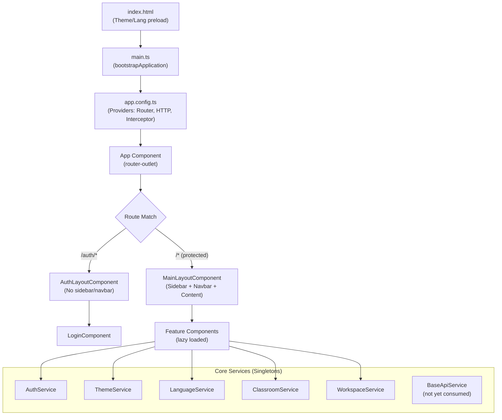

# NOOK Workspace — Complete Project Technical Documentation

> **Analysis Date:** August 28, 2026
> **Source of Truth:** Actual codebase in `c:\Users\fares\Documents\GitHub\Nook\Frontend`
> **Status:** ANALYSIS ONLY — No code changes made.

---

## Table of Contents

1. [Project Overview](#1-project-overview)
2. [Complete Folder Structure](#2-complete-folder-structure)
3. [File-by-File Explanation](#3-file-by-file-explanation)
4. [Application Architecture](#4-application-architecture)
5. [Application Startup Flow](#5-application-startup-flow)
6. [Routing](#6-routing)
7. [Authentication](#7-authentication)
8. [Shared Components](#8-shared-components)
9. [Classroom Feature](#9-classroom-feature)
10. [Classroom — Add Classroom (Booking)](#10-classroom--add-classroom-booking)
11. [Classroom — Show Classroom (Live Board)](#11-classroom--show-classroom-live-board)
12. [Classroom — Checkout](#12-classroom--checkout)
13. [Classroom — Add Reservation](#13-classroom--add-reservation)
14. [Classroom — Show Reservation](#14-classroom--show-reservation)
15. [Workspace Feature](#15-workspace-feature)
16. [Workspace — Add Student (Check-In)](#16-workspace--add-student-check-in)
17. [Workspace — Show Student](#17-workspace--show-student)
18. [Workspace — Checkout](#18-workspace--checkout)
19. [Classroom vs Workspace](#19-classroom-vs-workspace)
20. [Other Features](#20-other-features)
21. [Expected Future Pages](#21-expected-future-pages)
22. [API Readiness](#22-api-readiness)
23. [Mock/Test Structure](#23-mocktest-structure)
24. [Design System](#24-design-system)
25. [Dependency Maps](#25-dependency-maps)
26. [Business Flows](#26-business-flows)
27. [Final Project Knowledge Map](#27-final-project-knowledge-map)

---

## 1. Project Overview

**NOOK Workspace** is a management dashboard for a co-working/study space business located in Egypt. The application manages:

- **Workspace:** Student check-in/out for shared desks with hourly billing
- **Classrooms:** Room booking, live session monitoring, and checkout with financial breakdowns
- **Packages:** Instructor and student subscription packages with allocated hours
- **Shifts:** Staff shift management
- **Reservations:** Future room bookings
- **Catering:** Product management for a canteen/café
- **Details:** Discounts, colleges, blacklist, instructors
- **Settings:** User/staff management

### Technology Stack — CONFIRMED

| Aspect | Technology |
|--------|-----------|
| Framework | Angular 21.2 (standalone components) |
| Language | TypeScript 5.9 (strict mode) |
| State Management | Angular Signals (`signal()`, `computed()`) |
| Styling | Vanilla CSS with CSS custom properties |
| HTTP Client | Angular HttpClient with functional interceptors |
| Build | `@angular/build:application` |
| Test Runner | Vitest 4.0 |
| Package Manager | npm 11.11 |
| Formatter | Prettier 3.8 |
| i18n | Custom inline translation service (English/Arabic) |
| Direction | RTL/LTR support |
| Themes | Dark/Light via CSS `data-theme` attribute |
| Fonts | Poppins (EN body), Cairo (AR body), Quicksand (display) |
| Currency | EGP (Egyptian Pounds) |

### Key Design Decisions — CONFIRMED

1. **No third-party state management** — All state uses Angular Signals with localStorage persistence
2. **No backend connected yet** — All data is mock/in-memory with localStorage fallback
3. **Bilingual** — Full Arabic + English support via a monolithic `LanguageService` (1224 lines)
4. **Standalone components** — All components use the Angular standalone pattern
5. **Lazy loading** — Every feature page is lazy-loaded via `loadComponent()` in routes
6. **No NgModules** — Fully modular, no NgModule-based architecture

---

## 2. Complete Folder Structure

```
Frontend/
├── .editorconfig                 # Editor formatting rules
├── .prettierrc                   # Prettier config
├── .vscode/                      # VS Code settings
├── angular.json                  # Angular CLI workspace config
├── package.json                  # Dependencies & scripts
├── tsconfig.json                 # Root TypeScript config
├── tsconfig.app.json             # App-specific TS config
├── tsconfig.spec.json            # Test-specific TS config
├── docs/                         # Project documentation
│   ├── DESIGN_SYSTEM.md
│   ├── DESIGN_SYSTEM.html
│   ├── FILE_STRUCTURE.md
│   └── PROJECT_STRUCTURE.md
├── public/                       # Static assets (served as-is)
│   ├── favicon.ico
│   └── images/
│       ├── login-bg-dark.jpg
│       ├── login-bg-light.jpg
│       ├── logo-dark.png
│       ├── logo-light.png
│       └── rooms/
│           ├── room-design.jpg
│           ├── room-studio.jpg
│           └── room-workshop.jpg
└── src/
    ├── index.html                # HTML shell + theme/lang preload script
    ├── main.ts                   # Angular bootstrap entry
    ├── styles.css                # Global CSS design tokens & reset
    ├── testing/
    │   └── mocks/                # Development mock data
    │       ├── classrooms.mock.ts
    │       ├── classroom-sessions.mock.ts
    │       ├── rooms.mock.ts
    │       ├── sessions.mock.ts
    │       ├── students.mock.ts
    │       └── users.mock.ts
    └── app/
        ├── app.ts                # Root component
        ├── app.html              # Root template (<router-outlet>)
        ├── app.css               # Root styles (empty)
        ├── app.config.ts         # Providers: router, HTTP, interceptors
        ├── app.routes.ts         # All application routes
        ├── app.spec.ts           # Root component test
        ├── auth/                 # Authentication feature
        │   └── login/
        ├── core/                 # Singletons, shared across all features
        │   ├── constants/
        │   ├── guards/
        │   ├── interceptors/
        │   ├── models/
        │   └── services/
        ├── features/             # Feature modules (business domains)
        │   ├── catering/
        │   ├── classroom/
        │   ├── dashboard/
        │   ├── details/
        │   ├── package/
        │   ├── packages/
        │   ├── settings/
        │   ├── shift/
        │   └── workspace/
        ├── layouts/              # Page layout shells
        │   ├── auth-layout/
        │   └── main-layout/
        └── shared/               # Reusable components
            └── components/
```

### Folder Explanations

---

### `src/app/core/`

**Purpose:** Singleton services, models, guards, interceptors, and constants that are shared application-wide.

**Why it exists:** Prevents circular dependencies. Core services are `providedIn: 'root'` singletons.

**What belongs:** Services used by 2+ features, domain models, auth guard, HTTP interceptor, API endpoints, app-wide constants.

**What does NOT belong:** Feature-specific components, feature-specific logic, UI components.

**Dependents:** Every feature, every layout, every shared component.

#### `core/constants/`

| File | Purpose |
|------|---------|
| [api-endpoints.ts](file:///c:/Users/fares/Documents/GitHub/Nook/Frontend/src/app/core/constants/api-endpoints.ts) | Centralized API URL paths for all domains (auth, workspace, classroom, package, shift, reservation, details, catering, settings). Base URL: `http://localhost:3000/api` |
| [app.constants.ts](file:///c:/Users/fares/Documents/GitHub/Nook/Frontend/src/app/core/constants/app.constants.ts) | Type definitions (`UserRole`, `AuthRole`, `EntityStatus`, `BillingOption`, etc.), pagination defaults, localStorage keys, currency (`EGP`), theme modes |
| [routes.ts](file:///c:/Users/fares/Documents/GitHub/Nook/Frontend/src/app/core/constants/routes.ts) | All route path strings as a typed constant object. Used by sidebar, navigation, and `routerLink` directives |

#### `core/guards/`

| File | Purpose |
|------|---------|
| [auth.guard.ts](file:///c:/Users/fares/Documents/GitHub/Nook/Frontend/src/app/core/guards/auth.guard.ts) | Functional `CanActivateFn` guard. Checks `AuthService.isAuthenticated()` → redirects to `/auth/login` if not authenticated |

#### `core/interceptors/`

| File | Purpose |
|------|---------|
| [auth.interceptor.ts](file:///c:/Users/fares/Documents/GitHub/Nook/Frontend/src/app/core/interceptors/auth.interceptor.ts) | Functional `HttpInterceptorFn`. Reads `token` from localStorage, clones request with `Authorization: Bearer <token>` header |

#### `core/models/`

| File | Key Interfaces |
|------|---------------|
| [user.model.ts](file:///c:/Users/fares/Documents/GitHub/Nook/Frontend/src/app/core/models/user.model.ts) | `AuthUser` (login response), `User` (settings management), `AuthRole`, `UserRole` |
| [student.model.ts](file:///c:/Users/fares/Documents/GitHub/Nook/Frontend/src/app/core/models/student.model.ts) | `ActiveStudentSession` — full student session entity with check-in time, billing type, printing, wallet, WiFi |
| [classroom.model.ts](file:///c:/Users/fares/Documents/GitHub/Nook/Frontend/src/app/core/models/classroom.model.ts) | `Classroom`, `ClassroomCard` (live board), `SelectableRoom`, `CateringProductItem`, `ClassroomCoupon`, `ClassroomBookingPayload`, `ClassroomCheckoutPayload`, `ClassroomOvertimeResult` |
| [api-response.model.ts](file:///c:/Users/fares/Documents/GitHub/Nook/Frontend/src/app/core/models/api-response.model.ts) | Generic `PaginatedResponse<T>`, `ApiResponse<T>`, `ApiError` |
| [index.ts](file:///c:/Users/fares/Documents/GitHub/Nook/Frontend/src/app/core/models/index.ts) | Barrel export for all models |

#### `core/services/`

| File | Purpose | Size | Status |
|------|---------|------|--------|
| [auth.service.ts](file:///c:/Users/fares/Documents/GitHub/Nook/Frontend/src/app/core/services/auth.service.ts) | Authentication state via signals. Default user hardcoded for dev. `loginUser()`, `logout()`, `isAuthenticated()`, `getUser()`, `getRole()` | 48 lines | **Mocked** — no real API |
| [theme.service.ts](file:///c:/Users/fares/Documents/GitHub/Nook/Frontend/src/app/core/services/theme.service.ts) | Dark/Light theme toggle. Reads/writes `data-theme` attribute on `<html>` and persists to localStorage | 41 lines | **Implemented** |
| [language.service.ts](file:///c:/Users/fares/Documents/GitHub/Nook/Frontend/src/app/core/services/language.service.ts) | Full i18n system. ~400 translation keys for EN + AR. Manages `dir` attribute, `lang` attribute, localStorage persistence. `formatTimeLocale()` for Arabic numeral/period conversion | 1224 lines | **Implemented** |
| [classroom.service.ts](file:///c:/Users/fares/Documents/GitHub/Nook/Frontend/src/app/core/services/classroom.service.ts) | Classroom state management. Manages cards (live board), selectable rooms, canteen products, checkout card. Business logic: overtime calculation (grace period, extra hour), time parsing, coupon validation, live status refresh. Persists to localStorage | 372 lines | **Mocked** — uses localStorage + mock data |
| [workspace.service.ts](file:///c:/Users/fares/Documents/GitHub/Nook/Frontend/src/app/core/services/workspace.service.ts) | Student session management. Active students, history, blacklist. Check-in/out, block/unblock, edit/delete. Computed metrics (inside count, avg session, today check-ins, checkouts today). Toast notifications | 294 lines | **Mocked** — uses localStorage, starts empty |
| [student.service.ts](file:///c:/Users/fares/Documents/GitHub/Nook/Frontend/src/app/core/services/student.service.ts) | **Empty file** — 0 bytes. Placeholder | 0 lines | **Not implemented** |
| [api/base-api.service.ts](file:///c:/Users/fares/Documents/GitHub/Nook/Frontend/src/app/core/services/api/base-api.service.ts) | Base HTTP helper with `get<T>()`, `post<T>()`, `put<T>()`, `patch<T>()`, `delete<T>()` wrapping `HttpClient`. Uses `API_BASE_URL` from constants | 58 lines | **Implemented** — not yet consumed by any feature |

---

### `src/app/layouts/`

**Purpose:** Shell layouts that wrap routed content with persistent UI elements.

#### `layouts/auth-layout/`
- Minimal wrapper: just a `<div class="auth-container">` around `<router-outlet>`
- No sidebar, no navbar
- Used for `/auth/*` routes only

#### `layouts/main-layout/`
- Full dashboard shell with **sidebar** + **navbar** + content area
- CSS Grid layout: `sidebar | header` / `sidebar | content`
- Mobile responsive: switches to `flex-column`, sidebar becomes overlay with backdrop
- Manages `isSidebarOpen` state for mobile hamburger toggle
- **All protected routes** render inside this layout

---

### `src/app/shared/components/`

**Purpose:** Reusable UI components used by multiple features.

**What belongs:** Generic, feature-agnostic components.

**What does NOT belong:** Feature-specific business logic.

---

### `src/app/features/`

**Purpose:** Business domain feature modules. Each subdirectory is a self-contained feature.

**Organization:** Each feature has sub-pages like `add-*`, `show-*`, `checkout`, etc.

---

### `src/app/auth/`

**Purpose:** Authentication pages (currently only login).

---

### `src/testing/mocks/`

**Purpose:** Mock data files used during development before the backend API is connected.

---

## 3. File-by-File Explanation

### Root Configuration Files

| File | Responsibility | Key Details |
|------|---------------|-------------|
| [main.ts](file:///c:/Users/fares/Documents/GitHub/Nook/Frontend/src/main.ts) | Bootstrap entry point | Calls `bootstrapApplication(App, appConfig)` |
| [index.html](file:///c:/Users/fares/Documents/GitHub/Nook/Frontend/src/index.html) | HTML shell | Inline script for FOUC prevention: reads `nook-theme`/`nook-lang` from localStorage before Angular loads. Loads Google Fonts: Poppins, Quicksand, Cairo |
| [app.ts](file:///c:/Users/fares/Documents/GitHub/Nook/Frontend/src/app/app.ts) | Root component | Minimal: imports `RouterOutlet`, renders `<router-outlet>` |
| [app.config.ts](file:///c:/Users/fares/Documents/GitHub/Nook/Frontend/src/app/app.config.ts) | App providers | Registers `provideRouter(routes)`, `provideHttpClient(withInterceptors([authInterceptor]))`, `provideBrowserGlobalErrorListeners()` |
| [app.routes.ts](file:///c:/Users/fares/Documents/GitHub/Nook/Frontend/src/app/app.routes.ts) | Route definitions | 272 lines. All feature routes with lazy loading. Two layouts: `AuthLayoutComponent` (unprotected), `MainLayoutComponent` (protected with `authGuard`) |
| [styles.css](file:///c:/Users/fares/Documents/GitHub/Nook/Frontend/src/styles.css) | Global design tokens | 430 lines. CSS custom properties for dark/light themes, scrollbar styling, base button styles, typography, resets |

---

## 4. Application Architecture



**Architecture Pattern:** Feature-based folder structure with a shared core. No NgModules — all standalone components with lazy loading.

**State Pattern:** Signal-based reactive state in services, persisted to localStorage. No external state management library.

**Data Flow:** Components → inject Services → read Signals → modify via Service methods → Signals auto-update views.

---

## 5. Application Startup Flow

```
1. Browser loads index.html
   ↓
2. Inline <script> runs BEFORE Angular:
   - Reads 'nook-theme' from localStorage → sets data-theme on <html>
   - Reads 'nook-lang' from localStorage → sets lang/dir on <html>
   - Prevents Flash of Unstyled Content (FOUC)
   ↓
3. Google Fonts load (Poppins, Quicksand, Cairo)
   ↓
4. main.ts: bootstrapApplication(App, appConfig)
   ↓
5. appConfig registers:
   - provideRouter(routes)          → Route definitions
   - provideHttpClient(withInterceptors([authInterceptor]))  → HTTP + Bearer token
   - provideBrowserGlobalErrorListeners()  → Error handling
   ↓
6. App component renders <router-outlet>
   ↓
7. Router evaluates URL:
   - /auth/* → AuthLayoutComponent → LoginComponent
   - /* → authGuard checks AuthService.isAuthenticated()
     - If NOT authenticated → redirect to /auth/login
     - If authenticated → MainLayoutComponent
   ↓
8. MainLayoutComponent renders:
   - SidebarComponent (navigation + accordion menus)
   - NavbarComponent (search, theme toggle, language toggle, user info)
   - <router-outlet> for feature content
   ↓
9. Feature component lazy-loads and renders
   ↓
10. Services initialize:
    - AuthService: reads stored user from localStorage (default: admin@nook.io hardcoded)
    - ThemeService: reads stored theme, applies to DOM
    - LanguageService: reads stored language, sets dir/lang
    - ClassroomService: reads stored cards/rooms from localStorage (fallback: mock data)
    - WorkspaceService: reads stored students/history/blacklist from localStorage (fallback: empty)
```

> [!IMPORTANT]
> **AuthService has a hardcoded default user** (`admin@nook.io`, role `admin`). This means `isAuthenticated()` always returns `true` even on first visit. This is intentional for development — the guard never blocks access.

---

## 6. Routing

### Route Architecture

Two top-level route groups:

1. **Auth Layout** (`/auth/*`) — No guard, no sidebar
2. **Main Layout** (`/` and all other paths) — Protected by `authGuard`

### Complete Route Table

| Path | Component | Layout | Auth Required | Lazy Loaded | Status |
|------|-----------|--------|--------------|-------------|--------|
| `/auth/login` | `LoginComponent` | Auth | ❌ | ✅ | **Implemented** |
| `/auth` → redirects to `/auth/login` | — | Auth | ❌ | — | — |
| `/` → redirects to `/dashboard` | — | Main | ✅ | — | — |
| `/dashboard` | `DashboardComponent` | Main | ✅ | ✅ | **Partially implemented** |
| `/packages` | `PackagesComponent` | Main | ✅ | ✅ | **Implemented** |
| `/package/instructor` | `PackagesComponent` | Main | ✅ | ✅ | **Implemented** |
| `/package/student` | `PackagesComponent` | Main | ✅ | ✅ | **Implemented** |
| `/workspace/add-student` | `AddStudentComponent` | Main | ✅ | ✅ | **Implemented** |
| `/workspace/show-student` | `ShowStudentComponent` | Main | ✅ | ✅ | **Implemented** |
| `/workspace/checkout` | `WorkspaceCheckoutComponent` | Main | ✅ | ✅ | **Implemented** |
| `/classroom/add-classroom` | `AddClassroomComponent` | Main | ✅ | ✅ | **Implemented** |
| `/classroom/show-classroom` | `ShowClassroomComponent` | Main | ✅ | ✅ | **Implemented** |
| `/classroom/checkout` | `ClassroomCheckoutComponent` | Main | ✅ | ✅ | **Implemented** |
| `/classroom/add-reservation` | `AddReservationComponent` | Main | ✅ | ✅ | **Stub** |
| `/classroom/show-reservation` | `ShowReservationComponent` | Main | ✅ | ✅ | **Partially implemented** |
| `/shift/add-shift` | `AddShiftComponent` | Main | ✅ | ✅ | **Stub** |
| `/shift/show-shift` | `ShowShiftComponent` | Main | ✅ | ✅ | **Stub** |
| `/shift/search-shift` | `SearchShiftComponent` | Main | ✅ | ✅ | **Stub** |
| `/details/add-discount` | `AddDiscountComponent` | Main | ✅ | ✅ | **Stub** |
| `/details/show-colleges` | `ShowCollegesComponent` | Main | ✅ | ✅ | **Stub** |
| `/details/show-blacklist` | `ShowBlacklistComponent` | Main | ✅ | ✅ | **Partially implemented** |
| `/details/show-instructors` | `ShowInstructorsComponent` | Main | ✅ | ✅ | **Stub** |
| `/catering/add-products` | `AddProductsComponent` | Main | ✅ | ✅ | **Stub** |
| `/catering/show-products` | `ShowProductsComponent` | Main | ✅ | ✅ | **Stub** |
| `/catering/product-graph` | `ProductGraphComponent` | Main | ✅ | ✅ | **Stub** |
| `/settings/add-user` | `AddUserComponent` | Main | ✅ | ✅ | **Stub** |
| `/settings/show-user` | `ShowUserComponent` | Main | ✅ | ✅ | **Partially implemented** |
| `**` (wildcard) | → redirects to `/dashboard` | — | — | — | — |

> [!NOTE]
> "Stub" means the component exists but only has the language service injected and a template placeholder. No real business logic.

---

## 7. Authentication

### Complete Auth Flow

```
Login Page → User enters email + password
  ↓
LoginComponent.onSubmit()
  ↓
Hardcoded credential check (setTimeout 700ms to simulate API):
  - admin@nook.io / nook123 → AuthUser { role: 'admin' }
  - user@nook.io / nook123 → AuthUser { role: 'user' }
  - Anything else → "Invalid email or password" error
  ↓
AuthService.loginUser(user)
  - Sets currentUser signal
  - Stores user JSON in localStorage key 'nook_user'
  ↓
Router.navigate(['/dashboard'])
  ↓
authGuard checks AuthService.isAuthenticated()
  - Returns true (user signal is not null) → allows access
```

### Auth Components

| Component | Responsibility |
|-----------|---------------|
| `AuthService` | Manages `currentUser` signal, localStorage persistence. **Has hardcoded default user for dev** so the guard never blocks |
| `authGuard` | Functional `CanActivateFn` — checks `isAuthenticated()`, redirects to `/auth/login` |
| `authInterceptor` | Reads `token` from localStorage, adds `Authorization: Bearer` header. **Note: No token is currently stored** — the interceptor is wired up but the login flow doesn't store a token |
| `LoginComponent` | Email/password form with theme toggle, loading spinner, password visibility toggle, SVG icons, social links (Instagram, TikTok), animated "lamp" visual effect |

### Security Observations — CONFIRMED

1. **No real authentication API** — credentials are hardcoded in the component
2. **No JWT token flow** — the interceptor checks for `token` in localStorage, but nothing stores it
3. **Default user always logged in** — AuthService initializes with a hardcoded admin user
4. **No role-based route protection** — `authGuard` only checks `isAuthenticated()`, not roles
5. **No session expiration** — once logged in, user stays logged in until manual logout

---

## 8. Shared Components

### [SidebarComponent](file:///c:/Users/fares/Documents/GitHub/Nook/Frontend/src/app/shared/components/sidebar/sidebar.component.ts)

- **Purpose:** Main navigation with accordion-style expandable groups
- **Inputs:** `isOpen` (for mobile toggle)
- **Outputs:** `closeSidebar` event
- **Logic:** Tracks which menu groups are expanded via `openMenus` signal map. Auto-expands the group matching the current URL on navigation events. Logout button calls `AuthService.logout()` + navigates to login.
- **Used by:** `MainLayoutComponent`
- **Truly generic:** No — tightly coupled to NOOK navigation structure

### [NavbarComponent](file:///c:/Users/fares/Documents/GitHub/Nook/Frontend/src/app/shared/components/navbar/navbar.component.ts)

- **Purpose:** Top header bar with theme toggle, language toggle, search, user display
- **Outputs:** `toggleSidebar` event (for mobile hamburger)
- **Injects:** AuthService, LanguageService, ThemeService
- **Used by:** `MainLayoutComponent`
- **Truly generic:** No — specific to NOOK

### [MetricCardComponent](file:///c:/Users/fares/Documents/GitHub/Nook/Frontend/src/app/shared/components/metric-card/metric-card.component.ts)

- **Purpose:** KPI/stat display card (e.g., "Inside Right Now: 5", "Avg Session: 2h 30m")
- **Inputs:** `title` (required), `value` (required), `color` ('yellow'|'green'|'blue'|'purple'), `badge` (optional {text, type})
- **Used by:** Dashboard, ShowStudent (workspace)
- **Truly generic:** ✅ Yes — fully reusable

### [CheckoutModalComponent](file:///c:/Users/fares/Documents/GitHub/Nook/Frontend/src/app/shared/components/checkout-modal/checkout-modal.component.ts)

- **Purpose:** Unified checkout/payment modal used by both Workspace and Classroom
- **Inputs:** `data` (required `CheckoutData` — session info, financial breakdown, payment)
- **Outputs:** `close`, `paymentMethodChange`, `amountReceivedChange`, `discountChange`, `couponSubmit`, `addCatering`, `removeCatering`, `editRate`, `editPrinting`, `processPayment`
- **Models:** Defined in [checkout.models.ts](file:///c:/Users/fares/Documents/GitHub/Nook/Frontend/src/app/shared/components/checkout-modal/checkout.models.ts) — `CheckoutData`, `CheckoutSessionData`, `CheckoutFinancialData`, `CheckoutPaymentData`, `FinancialBreakdownItem`, `ProcessPaymentEvent`
- **Used by:** ShowStudent (workspace), ShowClassroom
- **Truly generic:** ✅ Yes — data-driven via `CheckoutData` interface

### [DateFilterDropdownComponent](file:///c:/Users/fares/Documents/GitHub/Nook/Frontend/src/app/shared/components/date-filter-dropdown/date-filter-dropdown.component.ts)

- **Purpose:** Date filter dropdown with Today/Yesterday/All/Custom options
- **Inputs:** `selectedOption`, `customDate`
- **Outputs:** `optionChange`, `customDateChange`
- **Features:** Arabic month names, locale-aware date formatting
- **Used by:** ShowStudent (workspace), ShowClassroom
- **Truly generic:** ✅ Yes

### [PrimaryButtonComponent](file:///c:/Users/fares/Documents/GitHub/Nook/Frontend/src/app/shared/components/primary-button/primary-button.component.ts)

- **Purpose:** Standard primary action button
- **Inputs:** `text`, `type` ('button'|'submit'), `fullWidth`
- **Outputs:** `clicked`
- **Truly generic:** ✅ Yes

### [SearchBoxComponent](file:///c:/Users/fares/Documents/GitHub/Nook/Frontend/src/app/shared/components/search-box/search-box.component.ts)

- **Purpose:** Search input with clear button
- **Inputs:** `placeholder`, `value`
- **Outputs:** `valueChange`
- **Truly generic:** ✅ Yes

### [CustomSelectComponent](file:///c:/Users/fares/Documents/GitHub/Nook/Frontend/src/app/shared/components/custom-select/custom-select.component.ts)

- **Purpose:** Custom styled dropdown select
- **Inputs:** `options` (required `SelectOption[]`), `selectedValue` (required)
- **Outputs:** `valueChange`
- **Truly generic:** ✅ Yes

### [ConfirmDialogComponent](file:///c:/Users/fares/Documents/GitHub/Nook/Frontend/src/app/shared/components/confirm-dialog/confirm-dialog.component.ts)

- **Purpose:** Reusable confirmation modal
- **Inputs:** `isOpen`, `title`, `message`
- **Outputs:** `confirm`, `cancel`
- **Truly generic:** ✅ Yes

### [ModalComponent](file:///c:/Users/fares/Documents/GitHub/Nook/Frontend/src/app/shared/components/modal/)

- **Purpose:** Generic modal wrapper (files exist but not deeply read)

### [FooterComponent](file:///c:/Users/fares/Documents/GitHub/Nook/Frontend/src/app/shared/components/footer/)

- **Purpose:** Page footer (files exist)

### [PageHeaderComponent](file:///c:/Users/fares/Documents/GitHub/Nook/Frontend/src/app/shared/components/page-header/)

- **Purpose:** Standardized page header

### [PaginationComponent](file:///c:/Users/fares/Documents/GitHub/Nook/Frontend/src/app/shared/components/pagination/)

- **Purpose:** Page navigation component

### [DataTableComponent](file:///c:/Users/fares/Documents/GitHub/Nook/Frontend/src/app/shared/components/data-table/)

- **Purpose:** Reusable data table component

---

## 9. Classroom Feature

### Feature Purpose

The Classroom feature manages **private rooms/classrooms** that can be booked by instructors for workshops, training sessions, or meetings. It is NOOK's primary revenue driver for room rentals.

### Business Purpose

- Book rooms for instructors conducting sessions
- Monitor active sessions in real-time (live board)
- Handle overtime (10-minute grace period, then extra-hour charges)
- Process checkout with financial breakdown (rental + catering + printing - discounts)
- Manage future reservations

### Main User Goals

1. Create a new room booking (select room, instructor, times, rates)
2. View all rooms on a live dashboard with status updates
3. Checkout a completed session with payment processing
4. Browse and manage reservations

### Connection to the Rest

- Uses **shared** `CheckoutModalComponent` for payment flow
- Shares **catering products** data with the Catering feature (embedded in ClassroomService)
- Reservation feature filters `ClassroomCard[]` from the same service

### Internal Structure

```
features/classroom/
├── add-classroom/       → Booking form (full-page)
├── show-classroom/      → Live board + booking modal + checkout modal
├── checkout/            → Standalone checkout page (alternative to modal)
├── add-reservation/     → Stub
└── show-reservation/    → Partially implemented
```

---

## 10. Classroom — Add Classroom (Booking)

### Page Overview

- **Page name:** New Classroom Booking
- **Route:** `/classroom/add-classroom`
- **Purpose:** Create a new room booking by filling out instructor details, selecting a room, and setting times
- **User:** Admin/Receptionist
- **Workflow:** Fill form → Select room → Set times → Review summary → Confirm → Redirect to live board

### UI

- **Header:** Page title "New Classroom Booking" with close (×) button linking back to show-classroom
- **Two-column layout:**
  - **Left column (Core Details + Rates):**
    - Instructor name input (with clear button)
    - Activity/Subject input
    - Phone + Email side-by-side
    - Hourly Rate + Printing Charges side-by-side
    - Booking Date (date picker with calendar icon)
    - Start Time / End Time (custom segmented time picker: HH:MM + AM/PM toggle pill + "Now" button)
    - Time validation error display
  - **Right column (Logistics + Summary):**
    - Room selector: grid of room thumbnail cards with image, name, max capacity. Active selection highlighted
    - Booking summary: room rental, printing charges, subtotal
    - Discount toggle card (10% discount switch)
    - Total display
- **Bottom action bar:** Cancel (ghost button → show-classroom) + Confirm Booking (primary, disabled until valid)

### Logic

- **Form validation:** `isFormValid` computed signal checks: instructor non-empty, activity non-empty, valid date (≥ today), hourly rate > 0, both times present, end > start, duration > 0
- **Time parsing:** Uses `ClassroomService.parseTimeToMinutes()` for HH:MM AM/PM format
- **Duration calculation:** Auto-computed from start/end times
- **Room selection:** Changes `hourlyRate` to match selected room's rate
- **"Now" button:** Sets start time to current time, auto-sets end time to +2 hours, auto-fills today's date
- **On submit:** Creates a `ClassroomCard` object, determines if session is currently active (`active` status) or future (`scheduled`), calls `classroomService.addBooking()`, navigates to show-classroom

### Data

- **Required:** Instructor name, activity, booking date, start/end times
- **Source:** `ClassroomService.rooms` (selectable rooms from mock/localStorage)
- **Models:** `ClassroomCard`, `SelectableRoom`
- **Mock data:** Room images from `/images/rooms/`

### API — `EXPECTED / NOT CURRENTLY CONNECTED`

- Expected endpoint: `POST /classrooms` with `ClassroomBookingPayload`
- Currently: all data saved to localStorage via `ClassroomService.addBooking()`

### Navigation

- **From:** Show Classroom page (live board) or sidebar link
- **To:** Show Classroom page (on successful booking)

### Current Status: **Implemented** (mocked data, no real API)

---

## 11. Classroom — Show Classroom (Live Board)

### Page Overview

- **Page name:** Classroom Live Board
- **Route:** `/classroom/show-classroom`
- **Purpose:** Real-time dashboard showing all classroom cards with their current status, elapsed time, and overtime alerts
- **User:** Admin/Receptionist
- **Workflow:** View cards → Filter/search → Click "Book" on empty room OR "Checkout" on active room → Manage via modals

### UI

- **Filter bar:**
  - Search box (search by name, instructor, activity)
  - Status dropdown (All / Active / Available)
  - Date filter dropdown (Today / This Week)
  - "+ New Booking" primary button
- **Card grid:** Each card shows:
  - Room image, name, color-coded theme (brown/blue/purple/emerald)
  - Status badge (Active / Available / Scheduled / Completed)
  - Instructor name, activity
  - Start time, end time, elapsed time (live updating)
  - Rental amount, catering amount
  - Overtime alert banners (3 tiers: ending soon / grace period / extra hour charged)
  - Action buttons: "Add Catering", "Book Room" (if available), "Checkout" (if active), "Edit" (if active)
- **Booking Modal:** Full booking form (same fields as add-classroom page, but in modal)
  - Room selector grid, time picker, coupon code input, hourly rate editing
  - Booking summary with subtotal, discount, total
- **Checkout Modal:** Uses shared `CheckoutModalComponent`
  - Financial breakdown: Room rental, Catering, Printing
  - Discount section with promo codes
  - Payment method selection (Cash/Vodafone/Fawry/InstaPay)
  - Amount received + change due calculation
- **Sub-modals (within checkout):**
  - Catering modal: product counter grid + custom amount input
  - Printing modal: pages × price calculator + custom amount
  - Rate & Duration modal: adjust hourly rate and hours billed

### Logic — EXTENSIVE (719 lines)

This is the **most complex component** in the entire application:

- **Live refresh:** `ngOnInit` starts a 5-second `setInterval` that calls `classroomService.refreshCardsStatus()` to update elapsed times and overtime alerts
- **Overtime system (3 tiers):**
  1. **Ending soon** (≤10 min remaining): yellow alert
  2. **Grace period** (0–10 min overdue): orange alert, no charge
  3. **Extra hour charged** (>10 min overdue): red alert, `ceil((overdue - 10) / 60)` extra hours
- **Booking modal:** Can create new OR edit existing bookings. Edit mode pre-fills all fields from the card
- **Checkout calculations:** room rate × hours + catering + printing - manual adjustment - loyalty discount = final amount
- **Coupon validation:** Delegates to `ClassroomService.validateCoupon()` which accepts predefined codes (NOOK10, SAVE10, etc.) and dynamic percentage patterns
- **Escape key handler:** Closes modals in priority order (sub-modals first)

### Data

- **Source:** `ClassroomService.cards` (signal), `ClassroomService.rooms`, `ClassroomService.canteenProducts`
- **Models:** `ClassroomCard`, `SelectableRoom`, `CateringProductItem`, `PaymentMethod`, `ClassroomCoupon`
- **Persistence:** localStorage

### API — `EXPECTED / NOT CURRENTLY CONNECTED`

- Expected: `GET /classrooms` → list of classroom sessions
- Expected: `POST /classrooms/checkout` → process payment
- Expected: Real-time updates via WebSocket or polling

### Navigation

- **From:** Sidebar, Dashboard
- **To:** Add Classroom (via "+ New Booking" or redirect), Checkout page (alternative)

### Current Status: **Implemented** (full UI + logic, mocked data)

---

## 12. Classroom — Checkout

### Page Overview

- **Page name:** Classroom Checkout
- **Route:** `/classroom/checkout`
- **Purpose:** Standalone checkout page (alternative to the checkout modal in show-classroom)
- **User:** Admin/Receptionist

### UI

- Full checkout form as a separate page (template exists)
- Financial breakdown, payment method selection, amount received/change due

### Logic

- **142 lines** of component logic
- On init: reads `cardId` from query params, or falls back to `activeCheckoutCard` from service, or finds first active card
- Initializes all financial fields from the card data
- Overtime calculation using `ClassroomService.calculateOvertimeAndAlerts()`
- Computed signals: `roomRentalTotal`, `subtotal`, `finalAmount`, `changeDue`
- `processPayment()`: calls `classroomService.checkoutRoom()`, navigates back to show-classroom

### Data

- Same as show-classroom checkout modal
- Card loaded from query param or service state

### API — `EXPECTED / NOT CURRENTLY CONNECTED`

### Current Status: **Implemented** (mocked)

---

## 13. Classroom — Add Reservation

### Page Overview

- **Route:** `/classroom/add-reservation`
- **Purpose:** Create a future room reservation

### Current Status: **Stub** — Only has `LanguageService` injected and a basic template. No form, no logic, no data.

### INFERRED FROM STRUCTURE

Expected to have:
- Reserver name, date, time slot selection
- Room assignment
- Deposit amount
- Translation keys exist: `reserverName`, `reservationDate`, `reservationTimeSlot`, `assignedSpace`, `depositAmount`, `saveReservation`

---

## 14. Classroom — Show Reservation

### Page Overview

- **Route:** `/classroom/show-reservation`
- **Purpose:** Display list of reservations

### Logic

- **23 lines** — Minimal
- Has a `reservations` computed signal that filters `classroomService.cards()` where status ≠ 'available'
- Essentially shows booked/active/scheduled classrooms as "reservations"

### Current Status: **Partially implemented** — Has data binding to classroom cards but limited UI

---

## 15. Workspace Feature

### Feature Purpose

The Workspace feature manages the **shared study/work desk area** where individual students check in and out on an hourly basis.

### Business Purpose

- Check in students arriving at the workspace
- Track active sessions with real-time duration
- Process checkout with billing (hourly rate, catering, printing, discounts)
- Manage student blacklist
- View session history

### Main Workflow

1. Student arrives → Receptionist opens "Add Student" or check-in modal
2. Fills student info (name, phone, email, college, faculty)
3. Selects billing type (new session / package / coupon)
4. Sets session price, printing, wallet amount
5. Student studies → duration tracked
6. Student leaves → Receptionist opens checkout
7. Financial breakdown calculated → payment processed → student moved to history

### Users Involved

- **Admin:** Full access
- **Receptionist:** Check-in/out, view students
- **Cashier:** Process payments (INFERRED from role types)

### Relationship with Other Features

- **Classroom:** Separate feature — workspace = shared desks, classroom = private rooms
- **Packages:** Students can use package hours for billing
- **Details/Blacklist:** Blocked students shown in `details/show-blacklist`, managed via `WorkspaceService`

### Internal Structure

```
features/workspace/
├── add-student/    → Full-page check-in form
├── show-student/   → Student list + metrics + all modals
└── checkout/       → Standalone checkout page
```

---

## 16. Workspace — Add Student (Check-In)

### Page Overview

- **Route:** `/workspace/add-student`
- **Purpose:** Full-page form to check in a new student
- **User:** Receptionist/Admin

### UI

- **Student Information section:** Name, Phone, Email, WhatsApp (with "Same as Phone" helper), College, Faculty
- **Session & Billing section:**
  - Date picker, Check-in time (auto-set to now), Expected checkout time
  - Billing type toggle: New Session / Package / Coupon
    - New Session: session price input
    - Package: package selection dropdown
    - Coupon: coupon code input
- **Extra Services section:** Printing counter (increment/decrement), Wallet amount, WiFi code
- **Confirm Check-In button**

### Logic

- **Validation:** Name required, phone must be exactly 11 digits (Egyptian format), email must be valid format
- **On confirm:** Calls `workspaceService.checkInStudent()` with all form data, navigates to show-student
- **Time formatting:** Converts 24h time input to 12h AM/PM display format

### Data

- **Models:** `ActiveStudentSession` (from student.model.ts)
- **Service:** `WorkspaceService.checkInStudent()` — generates ID (`STU-XXX`), sets status to 'active', persists to localStorage

### API — `EXPECTED / NOT CURRENTLY CONNECTED`

- Expected: `POST /workspace/checkin`

### Current Status: **Implemented** (mocked)

---

## 17. Workspace — Show Student

### Page Overview

- **Route:** `/workspace/show-student`
- **Purpose:** Main workspace dashboard showing active students, history, metrics, and all CRUD operations
- **User:** Receptionist/Admin

### UI

- **Metric cards row (4 cards):**
  1. Inside Right Now (count of active students)
  2. Avg Session (computed from all durations)
  3. Today's Check-ins (count)
  4. Checkouts Today (count)
- **Tab bar:** Active Students | History
- **Filter bar:** Search box, Date filter dropdown, "+ New Student Check-In" button
- **Student table/cards:** Name, phone, faculty, check-in time, duration, cost, status, actions menu
- **Actions menu (per student):** Edit, Checkout, Block, Delete
- **Pagination:** Page navigation with configurable page size (default: 3)
- **Modals:**
  - **Check-In modal:** Full student registration form (duplicate of add-student page but in modal)
  - **Checkout modal:** Uses shared `CheckoutModalComponent` with financial breakdown
  - **Edit modal:** Modify student details (name, phone, whatsapp, college, faculty, package, printing, wallet)
  - **Block modal:** Block student with reason, adds to blacklist
  - **Delete confirmation modal**
- **Toast notifications:** Success/info/error toasts from WorkspaceService

### Logic — EXTENSIVE (702 lines)

Second most complex component in the project:

- **Tab switching:** Toggles between active students and history (completed students)
- **Search:** Filters by name, faculty, college, phone
- **Date filter:** Today / Yesterday / All / Custom date
- **Pagination:** Client-side with computed `paginatedStudents`, `totalPages`, `startIndex`, `endIndex`
- **Check-in modal:** Full validation (name, phone 11 digits, email format) with inline error messages
- **Checkout flow:** Calculates duration, base cost, catering, printing, discounts. Supports coupon codes (NOOK10, SAVE10, STUDENT → 10 EGP off)
- **Block flow:** Sets student status to 'blocked', creates `BlacklistRecord` in WorkspaceService
- **Unblock:** Restores student status, removes from blacklist

### Data

- **Sources:** `WorkspaceService.activeStudents`, `WorkspaceService.historyStudents`, `WorkspaceService.blacklist`
- **Computed metrics:** `insideCount`, `avgSession`, `todayCheckins`, `checkoutsToday`
- **Models:** `ActiveStudentSession`, `CateringLineItem` (local), `CheckoutData`

### API — `EXPECTED / NOT CURRENTLY CONNECTED`

- Expected: `GET /workspace/students`, `POST /workspace/checkout`

### Current Status: **Implemented** (full UI + logic, mocked data)

---

## 18. Workspace — Checkout

### Page Overview

- **Route:** `/workspace/checkout`
- **Purpose:** Standalone checkout page (alternative to modal in show-student)
- **User:** Receptionist/Admin

### UI

- **User Information:** Student name, ID, faculty, phone, email
- **Session Details:** Check-in time, checkout time (auto), duration, hourly rate
- **Billing Details:** Base cost, discount percentage, applied discounts
- **Catering line items:** List with remove button, "+ Add Item" button
- **Payment section:** Method selection (Cash/Vodafone/Fawry/InstaPay), amount received, change to return
- **Action buttons:** Add Discount modal, Add Item modal, Finalize & Close

### Logic

- **167 lines**
- On init: reads `studentId` from query params, loads student from WorkspaceService
- Pre-populated with mock data (student name in Arabic, faculty, hardcoded catering items)
- Coupon support (NOOK10, SAVE10 → 20 EGP; anything else → 10 EGP)
- `finalizeAndClose()`: calls `workspaceService.checkOutStudent()`, shows toast, navigates back

### Data

- Loads from `WorkspaceService.activeStudents()` by ID
- Falls back to hardcoded demo data if no student found

### API — `EXPECTED / NOT CURRENTLY CONNECTED`

### Current Status: **Implemented** (mocked with hardcoded demo data fallback)

---

## 19. Classroom vs Workspace

| Aspect | Classroom | Workspace |
|--------|-----------|-----------|
| **Entity** | Room/Classroom | Shared desk/seat |
| **User** | Instructor (external) | Student (external) |
| **Booking unit** | Entire room for time block | Individual desk, open-ended |
| **Pricing** | Hourly rate per room (40–80 EGP) | Hourly rate per student (30 EGP default) |
| **Duration** | Pre-defined (start–end time) | Open (tracked from check-in) |
| **Overtime** | 3-tier system (grace period → extra hour) | No overtime system |
| **Catering** | Integrated in checkout (canteen products) | Integrated in checkout (line items) |
| **Printing** | Per-session charge | Per-student count |
| **Checkout** | Both modal + standalone page | Both modal + standalone page |
| **Service** | `ClassroomService` (372 lines) | `WorkspaceService` (294 lines) |
| **Data model** | `ClassroomCard`, `SelectableRoom` | `ActiveStudentSession` |
| **Mock data** | Yes — 4 initial classroom cards | No — starts empty |
| **Blacklist** | N/A | Yes — via WorkspaceService |

### Shared Between Both

- `CheckoutModalComponent` — same checkout UI pattern
- `DateFilterDropdownComponent` — same date filtering
- `LanguageService` — same translation system
- Payment method types (cash/vodafone/fawry/instapay)
- Currency (EGP)
- localStorage persistence pattern

### Must Remain Separate

- Overtime/grace period logic (Classroom only)
- Room selection/selector (Classroom only)
- Student blacklist/block (Workspace only)
- Session metrics dashboard (Workspace only)
- Live status refresh timer (Classroom only — 5-second interval)

### Potential Duplication Issues

1. `CateringLineItem` interface is defined in **3 places**: checkout.models.ts, show-student.component.ts, checkout.component.ts (workspace)
2. Time formatting/parsing logic exists in both ClassroomService and WorkspaceService
3. Coupon validation exists in ClassroomService but workspace has its own hardcoded coupon logic
4. `getTodayDateISO()` helper is duplicated in ClassroomService and WorkspaceService

---

## 20. Other Features

### Dashboard (`/dashboard`)

- **Status:** Partially implemented
- **What exists:** Component with LanguageService, MetricCardComponent, RouterLink. Template has metric cards and layout. **633 bytes** of logic.
- **What's missing:** Real data connections, charts, graphs, recent activity feed

### Packages (`/packages`, `/package/instructor`, `/package/student`)

- **Status:** **Implemented** — Significant component (19,525 bytes, 547 lines)
- **What exists:** Full `PackagesComponent` with:
  - Instructor/Student tab switching (based on route)
  - Package list with search and status filtering
  - Sell Package modal (create new package for a member)
  - Package detail drawer (view/edit package, usage history)
  - Mock data for packages and members
  - Package models: `PackageItem`, `MemberItem`, `UsageHistory`
  - Status management: active, near_expiry, expired, exhausted
- **What's missing:** API integration. The `package/` directory also contains stub sub-components (`add-instructor-package`, `add-student-package`, `show-instructor-package`, `show-student-package`) that are **not used by routes** — routes redirect to the unified `PackagesComponent`

### Shift (`/shift/*`)

- **Status:** All 3 pages are **stubs** (~380 bytes each)
- **Existing:** `AddShiftComponent`, `ShowShiftComponent`, `SearchShiftComponent` — each only has LanguageService injected
- **Expected:** Staff shift tracking with start/end times, cash drawer amounts
- **Translation keys exist:** `shiftStaffName`, `shiftStartTime`, `shiftEndTime`, `shiftCashDrawer`

### Details (`/details/*`)

| Page | Status | Details |
|------|--------|---------|
| `add-discount` | **Stub** | 391 bytes. Only LanguageService |
| `show-colleges` | **Stub** | 395 bytes. Only LanguageService |
| `show-blacklist` | **Partially implemented** | 1543 bytes. Has real logic: reads `WorkspaceService.blacklist`, supports search, unblock confirmation modal |
| `show-instructors` | **Stub** | 407 bytes. Only LanguageService |

### Catering (`/catering/*`)

- **Status:** All 3 pages are **stubs** (~391–395 bytes each)
- **Translation keys exist:** `productName`, `productCategory`, `productPrice`, `stockQuantity`
- **Note:** Catering products are hardcoded in `ClassroomService` as `DEFAULT_CANTEEN_PRODUCTS` (coffee, tea, water, soda, snack, lunch)

### Settings (`/settings/*`)

| Page | Status | Details |
|------|--------|---------|
| `add-user` | **Stub** | 375 bytes |
| `show-user` | **Partially implemented** | 602 bytes. Imports `MOCK_USERS` from testing/mocks and renders them |

---

## 21. Expected Future Pages

### CONFIRMED BY CODE

- **Packages:** Route structure and complete component with sell/detail modals already work
- **Blacklist:** `ShowBlacklistComponent` works and reads from `WorkspaceService`
- **Show Users:** `ShowUserComponent` renders mock user data

### INFERRED FROM STRUCTURE

Based on existing translation keys, route constants, API endpoints, and models:

| Feature | Expected Pages | Evidence |
|---------|---------------|----------|
| Shift | Add shift form (staff name, start/end time, cash drawer) | Translation keys `shiftStaffName`, `shiftStartTime`, `shiftEndTime`, `shiftCashDrawer` |
| Shift | Show shifts list/table | Route exists, translation keys exist |
| Shift | Search shifts by criteria | Route and component exist |
| Details | Add discount form (code, percentage) | Translation keys `discountCode`, `discountPercent`, `saveDiscount` |
| Details | Show colleges list | Route exists |
| Details | Show instructors list (name, specialization) | Translation keys `instructorName`, `specialization` |
| Catering | Add products form (name, category, price, stock) | Translation keys exist |
| Catering | Show products list | Route exists |
| Catering | Product analytics/graph | Route exists, API endpoint `catering/analytics` defined |
| Settings | Add user form (name, email, role) | Translation keys `userRole`, `saveUser` |
| Reservation | Full reservation form (reserver name, date, time slot, space, deposit) | Translation keys exist |

### UNKNOWN / NEEDS REQUIREMENTS

- Dashboard: What specific KPIs, charts, and data sources?
- Shift: What business rules for shift overlaps, cash reconciliation?
- Catering: Product graph — what analytics? Sales over time? Category breakdown?
- Settings: Role-based access control implementation details?
- Reservation: Deposit handling, cancellation policy, calendar view?

---

## 22. API Readiness

### Classroom API Readiness

| Page | Required Data | Existing Service | API Connected? | Mock? | Expected API Need |
|------|---------------|-----------------|----------------|-------|-------------------|
| Add Classroom | Rooms list, booking creation | `ClassroomService` | ❌ | ✅ localStorage + mock seed | `POST /classrooms`, `GET /classrooms` (rooms) |
| Show Classroom | Live card list, status updates | `ClassroomService` | ❌ | ✅ localStorage + mock seed | `GET /classrooms`, WebSocket for live updates |
| Checkout | Card details, payment processing | `ClassroomService` | ❌ | ✅ localStorage | `POST /classrooms/checkout` |
| Add Reservation | Room availability, reservation creation | — | ❌ | ❌ No data | `POST /reservations` |
| Show Reservation | Reservation list | `ClassroomService` (filtered cards) | ❌ | ✅ Partial | `GET /reservations` |

### Workspace API Readiness

| Page | Required Data | Existing Service | API Connected? | Mock? | Expected API Need |
|------|---------------|-----------------|----------------|-------|-------------------|
| Add Student | Student check-in data | `WorkspaceService` | ❌ | ✅ localStorage, starts empty | `POST /workspace/checkin` |
| Show Student | Active/history students, metrics | `WorkspaceService` | ❌ | ✅ localStorage, starts empty | `GET /workspace/students`, `GET /workspace/students?status=active` |
| Checkout | Student session + financial data | `WorkspaceService` | ❌ | ✅ localStorage + hardcoded demo | `POST /workspace/checkout` |

### Other Features API Readiness

| Feature | API Connected? | Expected Endpoints |
|---------|----------------|-------------------|
| Auth | ❌ | `POST /auth/login`, `POST /auth/logout`, `POST /auth/refresh` |
| Packages | ❌ | `GET /packages/student`, `GET /packages/instructor`, `POST /packages/:id` |
| Shift | ❌ | `GET /shifts`, `POST /shifts`, `GET /shifts/search` |
| Details | ❌ | `GET /details/discounts`, `GET /details/colleges`, `GET /details/blacklist`, `GET /details/instructors` |
| Catering | ❌ | `GET /catering/products`, `POST /catering/products`, `GET /catering/analytics` |
| Settings | ❌ | `GET /settings/users`, `POST /settings/users` |

> [!IMPORTANT]
> **BaseApiService exists and is fully implemented** with typed HTTP methods, but **no feature service extends or uses it yet**. All data flows through direct signal manipulation with localStorage persistence.

---

## 23. Mock/Test Structure

### Mock Files

| Mock File | Represents | Used By | Feature |
|-----------|-----------|---------|---------|
| [classrooms.mock.ts](file:///c:/Users/fares/Documents/GitHub/Nook/Frontend/src/testing/mocks/classrooms.mock.ts) | 4 initial `ClassroomCard` objects (3 active, 1 available) | `ClassroomService` (initial seed) | Classroom |
| [rooms.mock.ts](file:///c:/Users/fares/Documents/GitHub/Nook/Frontend/src/testing/mocks/rooms.mock.ts) | 6 `SelectableRoom` definitions with images, rates, capacities, color themes | `ClassroomService` (room selector) | Classroom |
| [classroom-sessions.mock.ts](file:///c:/Users/fares/Documents/GitHub/Nook/Frontend/src/testing/mocks/classroom-sessions.mock.ts) | 2 `MockRoomSession` records | **Not imported by any component** | Classroom (unused) |
| [sessions.mock.ts](file:///c:/Users/fares/Documents/GitHub/Nook/Frontend/src/testing/mocks/sessions.mock.ts) | 3 `MockSession` records (workspace sessions) | **Not imported by any component** | Workspace (unused) |
| [students.mock.ts](file:///c:/Users/fares/Documents/GitHub/Nook/Frontend/src/testing/mocks/students.mock.ts) | 3 `MockStudent` records | **Not imported by any component** | Workspace (unused) |
| [users.mock.ts](file:///c:/Users/fares/Documents/GitHub/Nook/Frontend/src/testing/mocks/users.mock.ts) | 3 `MockUser` records (admin, shift manager, receptionist) | `ShowUserComponent` | Settings |

### Mock vs Production Separation

- **Classroom mock data** is loaded as the initial seed in `ClassroomService` constructor. Once the user adds/modifies data, localStorage takes over.
- **Workspace data** starts completely empty (no mock seed). All `DEFAULT_*` arrays are `[]`.
- **User mock data** is directly imported in the `ShowUserComponent`.
- **3 mock files** (`classroom-sessions.mock.ts`, `sessions.mock.ts`, `students.mock.ts`) exist but are **not imported anywhere** — they were extracted from components but never connected.

### What Needs Replacement by API

All mock data needs replacement. Priority order:
1. Auth (login API) — currently hardcoded credentials
2. Workspace students (check-in/out API)
3. Classroom bookings (CRUD API)
4. Packages (CRUD + usage tracking)
5. All remaining features (shifts, details, catering, settings)

---

## 24. Design System

### Colors (CSS Custom Properties)

**Brand Colors:**
- `--yellow: #f5b921` — Primary accent (buttons, highlights)
- `--yellow-hover: #ffca3a`
- `--warm: #ffcf5a`
- `--gold: #c79a3a` / `--gold-line: #d8b877`
- `--brand-dark: #1c1810` — Sidebar background (warm dark brown)

**Dark Theme:**
- `--page: #0a0a0b` (near-black)
- `--surface: #17181c` (card background)
- `--sidebar-bg: #0d0e11`
- `--header-bg: #0d0e11`
- `--text: #f2f2f4`
- `--text-dim: #9a9ba6`
- `--border: #2a2b33`
- `--accent: #ffcf5a`
- `--danger: #ff7a6b`
- `--success: #3ec98a`

**Light Theme:**
- `--page: #f2ede2` (warm cream)
- `--surface: #ffffff`
- `--text: #1f1b12`
- `--accent: #bd7f00`
- `--danger: #e04343`
- `--success: #1f9d61`

**Room Color Themes:**
- `brown` → `#92400e` (Amber Gold)
- `blue` → `#2563eb` (Sapphire)
- `purple` → `#7c3aed` (Creative Violet)
- `emerald` → `#059669` (Mint)

### Typography

| Token | Font | Usage |
|-------|------|-------|
| `--font-en` | Poppins | English body text |
| `--font-ar` | Cairo | Arabic body text |
| `--font-display` | Quicksand, Cairo | Headings, buttons, display text |
| `--font-body` | Switches between `--font-en` and `--font-ar` based on `dir` attribute |

### Spacing

- `--header-h: 64px` — Top header height
- `--sidebar-w: 256px` — Sidebar width
- `--radius: 14px` — Card border radius
- `--radius-sm: 10px` — Button/input border radius
- Content padding: `28px 32px` (desktop), `20px 16px` (mobile)

### RTL/LTR Support

- Managed by `LanguageService.setLanguage()` which sets `dir` and `lang` on `<html>`
- CSS uses logical properties where needed
- Font family switches via `[dir="rtl"]` CSS selector

### Shared Button Styles (Global)

- `.btn` — Base button (42px height, display:flex, gap:8px, transitions)
- `.btn--primary` — Yellow accent with dark text
- `.btn--ghost` — Transparent with border
- `.btn--disabled` — Reduced opacity, no pointer events

### Design Inconsistencies Found

1. **Login page** has its own isolated design system (lamp animation, custom card styles) — separate from the main dashboard design
2. **Catering products** in `ClassroomService` contain hardcoded Arabic text mixed with English names
3. **WorkspaceService toast messages** are hardcoded in Arabic regardless of language setting in some places
4. **PaymentMethod type** is defined in classroom.model.ts but also used as inline string unions in workspace checkout

---

## 25. Dependency Maps

### Classroom Dependency Map

```
Classroom Pages
  ├── AddClassroomComponent
  │     ├── FormsModule, RouterLink
  │     ├── LanguageService → translations
  │     └── ClassroomService
  │           ├── rooms (signal) ← MOCK_SELECTABLE_ROOMS
  │           ├── parseTimeToMinutes()
  │           ├── isSessionActive()
  │           ├── calculateElapsed()
  │           ├── addBooking()
  │           └── localStorage persistence
  │
  ├── ShowClassroomComponent (MOST COMPLEX)
  │     ├── FormsModule
  │     ├── PrimaryButtonComponent
  │     ├── SearchBoxComponent
  │     ├── DateFilterDropdownComponent
  │     ├── CustomSelectComponent
  │     ├── CheckoutModalComponent → checkout.models.ts
  │     ├── LanguageService → translations, isArabic, formatTimeLocale
  │     └── ClassroomService
  │           ├── cards (signal) ← MOCK_CLASSROOM_CARDS
  │           ├── rooms (signal)
  │           ├── canteenProducts (signal)
  │           ├── refreshCardsStatus()
  │           ├── calculateOvertimeAndAlerts()
  │           ├── validateCoupon()
  │           ├── addBooking() / updateCard()
  │           ├── checkoutRoom()
  │           ├── addCatering() / addPrinting()
  │           └── setActiveCheckoutCard()
  │
  ├── ClassroomCheckoutComponent
  │     ├── FormsModule, ActivatedRoute
  │     ├── LanguageService
  │     └── ClassroomService (same methods as above)
  │
  ├── AddReservationComponent (STUB)
  │     └── LanguageService
  │
  └── ShowReservationComponent
        ├── LanguageService
        └── ClassroomService.cards (filtered)
```

### Workspace Dependency Map

```
Workspace Pages
  ├── AddStudentComponent
  │     ├── FormsModule, RouterLink
  │     ├── LanguageService → translations, isArabic
  │     └── WorkspaceService
  │           ├── checkInStudent()
  │           ├── showToast()
  │           └── localStorage persistence
  │
  ├── ShowStudentComponent (SECOND MOST COMPLEX)
  │     ├── FormsModule, RouterLink
  │     ├── DateFilterDropdownComponent
  │     ├── PrimaryButtonComponent
  │     ├── CheckoutModalComponent → checkout.models.ts
  │     ├── LanguageService
  │     └── WorkspaceService
  │           ├── activeStudents / historyStudents / blacklist (signals)
  │           ├── insideCount / avgSession / todayCheckins / checkoutsToday (computed)
  │           ├── checkInStudent() / checkOutStudent()
  │           ├── deleteStudent() / updateStudent()
  │           ├── blockStudent() / unblockStudent()
  │           ├── showToast()
  │           └── localStorage persistence
  │
  └── WorkspaceCheckoutComponent
        ├── FormsModule, RouterLink, ActivatedRoute
        ├── LanguageService
        └── WorkspaceService
              ├── activeStudents() (read for student lookup)
              ├── checkOutStudent()
              └── showToast()
```

---

## 26. Business Flows

### Classroom Business Flow

```
1. BOOKING CREATION
   Admin opens "Add Classroom" or "New Booking" modal
   ↓
   Selects room from visual grid (Nook 1/2/3, Studio A, Innovation Hub, Lab A)
   ↓
   Enters: Instructor, Activity, Phone, Email, Date, Start/End Time
   ↓
   System auto-calculates: Duration, Room Rental (rate × hours), Printing, Subtotal
   ↓
   Optional: Apply 10% discount toggle
   ↓
   Submit → Card created with status 'active' or 'scheduled'
   ↓
   Redirected to Live Board

2. LIVE MONITORING
   Show Classroom page auto-refreshes every 5 seconds
   ↓
   For each active card:
     - Calculates elapsed time from check-in
     - Checks if session has ended
     - Applies overtime alerts:
       Alert 1: ≤10 min remaining → "ending soon" (yellow)
       Alert 2: 0–10 min past end → "grace period" (orange) — no extra charge
       Alert 3: >10 min past end → "extra hour charged" (red) — ceil((overdue-10)/60) hours added

3. CHECKOUT
   Admin clicks "Checkout" on active card
   ↓
   Checkout modal opens with:
     - Room rental (rate × actual hours including overtime)
     - Catering charges (add via product picker or custom amount)
     - Printing charges (pages × price or custom amount)
     - Manual adjustment & loyalty discount
   ↓
   Select payment method (Cash / Vodafone Cash / Fawry / InstaPay)
   ↓
   Enter amount received → system calculates change due
   ↓
   Process Payment → room reset to 'available', card cleared
```

### Workspace Business Flow

```
1. STUDENT CHECK-IN
   Receptionist opens "Add Student" form or check-in modal
   ↓
   Enters: Name, Phone (11 digits), Email, WhatsApp, College, Faculty
   ↓
   Selects billing type:
     - New Session → sets session price (default 40 EGP/hr)
     - Package → selects from student packages
     - Coupon → enters coupon code
   ↓
   Optional: Set expected checkout, printing count, wallet amount, WiFi code
   ↓
   Confirm Check-In → student added to active list with status 'active'
   ↓
   Toast: "تم تسجيل دخول الطالب بنجاح!"

2. MONITORING
   Show Students page displays:
     - Metric cards: Inside count, Avg session, Today check-ins, Today checkouts
     - Active tab: currently present students
     - History tab: checked-out students
   ↓
   Filters: Search, Date filter (Today/Yesterday/All/Custom)

3. ACTIONS ON STUDENT
   Via action menu (⋮):
     - Edit → modify student info
     - Checkout → open checkout modal
     - Block → add to blacklist with reason → student status becomes 'blocked'
     - Delete → remove from both active and history

4. CHECKOUT
   Admin opens checkout modal for student
   ↓
   Financial breakdown:
     - Base cost (hourly rate × duration)
     - Catering items (add/remove line items)
     - Printing (page count × 1.5 EGP/page)
     - Faculty discount (percentage)
     - Coupon discount (code-based)
   ↓
   Select payment method → enter amount → calculate change
   ↓
   Process → student moved from active to history with status 'completed'
```

### Cross-Feature Interactions

```
Workspace → Block Student → Details/Show Blacklist (reads WorkspaceService.blacklist)
Workspace → Use Package → Packages feature (billing type selection)
Classroom → Catering → Catering feature (shared product definitions in ClassroomService)
Both → Checkout → Shared CheckoutModalComponent
```

---

## 27. Final Project Knowledge Map

```
NOOK Workspace Frontend Application
│
├── Core (src/app/core/)
│   ├── Authentication
│   │   ├── AuthService (signal-based, mocked default user)
│   │   ├── authGuard (CanActivateFn → redirects unauthenticated)
│   │   └── authInterceptor (Bearer token from localStorage)
│   │
│   ├── API Layer
│   │   ├── BaseApiService (typed HTTP helpers — NOT YET CONSUMED)
│   │   └── API_ENDPOINTS (centralized URL paths — NOT YET USED)
│   │
│   ├── Domain Services
│   │   ├── ClassroomService (372 lines — cards, rooms, overtime, coupons)
│   │   ├── WorkspaceService (294 lines — students, history, blacklist, metrics)
│   │   ├── ThemeService (dark/light toggle)
│   │   ├── LanguageService (1224 lines — EN/AR translations, RTL/LTR)
│   │   └── StudentService (EMPTY — 0 lines)
│   │
│   ├── Models
│   │   ├── user.model.ts (AuthUser, User, roles)
│   │   ├── student.model.ts (ActiveStudentSession)
│   │   ├── classroom.model.ts (10+ interfaces)
│   │   └── api-response.model.ts (generic wrappers)
│   │
│   └── Constants
│       ├── app.constants.ts (types, pagination, storage keys, currency)
│       ├── api-endpoints.ts (all API paths)
│       └── routes.ts (all route strings)
│
├── Layouts (src/app/layouts/)
│   ├── AuthLayoutComponent (minimal wrapper for /auth/*)
│   └── MainLayoutComponent (sidebar + navbar + content grid)
│
├── Shared Components (src/app/shared/components/)
│   ├── sidebar (navigation accordion)
│   ├── navbar (theme/lang toggle, search, user info)
│   ├── checkout-modal ★ (unified checkout for workspace + classroom)
│   ├── metric-card ★ (KPI display)
│   ├── date-filter-dropdown ★ (today/yesterday/all/custom)
│   ├── primary-button ★
│   ├── search-box ★
│   ├── custom-select ★
│   ├── confirm-dialog ★
│   ├── data-table
│   ├── pagination
│   ├── page-header
│   ├── modal
│   └── footer
│
├── Features (src/app/features/)
│   ├── Dashboard                          [PARTIAL]
│   │   └── dashboard.component            (metrics cards, basic layout)
│   │
│   ├── Classroom ★                        [IMPLEMENTED - MOCKED]
│   │   ├── add-classroom                  (full booking form)
│   │   ├── show-classroom ★               (live board + booking/checkout modals — 719 lines)
│   │   ├── checkout                       (standalone checkout page)
│   │   ├── add-reservation                [STUB]
│   │   └── show-reservation               [PARTIAL]
│   │
│   ├── Workspace ★                        [IMPLEMENTED - MOCKED]
│   │   ├── add-student                    (full check-in form)
│   │   ├── show-student ★                 (student dashboard + all modals — 702 lines)
│   │   └── checkout                       (standalone checkout page)
│   │
│   ├── Packages                           [IMPLEMENTED - MOCKED]
│   │   └── packages.ts                    (unified instructor/student packages — 547 lines)
│   │
│   ├── Shift                              [STUBS]
│   │   ├── add-shift
│   │   ├── show-shift
│   │   └── search-shift
│   │
│   ├── Details                            [MIXED]
│   │   ├── add-discount                   [STUB]
│   │   ├── show-colleges                  [STUB]
│   │   ├── show-blacklist                 [PARTIAL - reads WorkspaceService]
│   │   └── show-instructors               [STUB]
│   │
│   ├── Catering                           [STUBS]
│   │   ├── add-products
│   │   ├── show-products
│   │   └── product-graph
│   │
│   └── Settings                           [MIXED]
│       ├── add-user                       [STUB]
│       └── show-user                      [PARTIAL - reads MOCK_USERS]
│
├── Auth (src/app/auth/)
│   └── login                              [IMPLEMENTED - MOCKED]
│       └── login.component                (email/password form, theme toggle, lamp animation)
│
├── Testing (src/testing/)
│   └── mocks/
│       ├── classrooms.mock.ts             (4 classroom cards — USED by ClassroomService)
│       ├── rooms.mock.ts                  (6 selectable rooms — USED by ClassroomService)
│       ├── classroom-sessions.mock.ts     (2 sessions — UNUSED)
│       ├── sessions.mock.ts              (3 sessions — UNUSED)
│       ├── students.mock.ts             (3 students — UNUSED)
│       └── users.mock.ts               (3 users — USED by ShowUserComponent)
│
└── Static Assets (public/)
    ├── favicon.ico
    └── images/
        ├── login-bg-dark.jpg, login-bg-light.jpg
        ├── logo-dark.png, logo-light.png
        └── rooms/ (room-design.jpg, room-studio.jpg, room-workshop.jpg)
```

**Legend:**
- ★ = Complex / High-priority component
- [IMPLEMENTED] = Full UI + logic, data mocked
- [PARTIAL] = Some logic, incomplete UI/functionality
- [STUB] = Only LanguageService injected, placeholder template
- [MOCKED] = Uses localStorage/signals instead of real API

---

> [!CAUTION]
> **No backend API is connected.** The entire application runs on client-side signals with localStorage persistence. The `BaseApiService` and `API_ENDPOINTS` are prepared but not consumed by any feature service. All data will be lost if localStorage is cleared.
